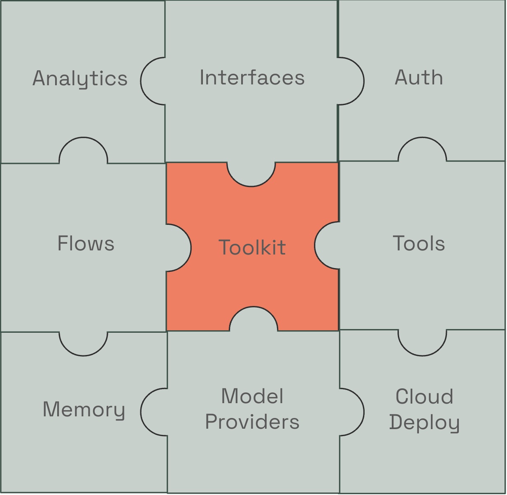
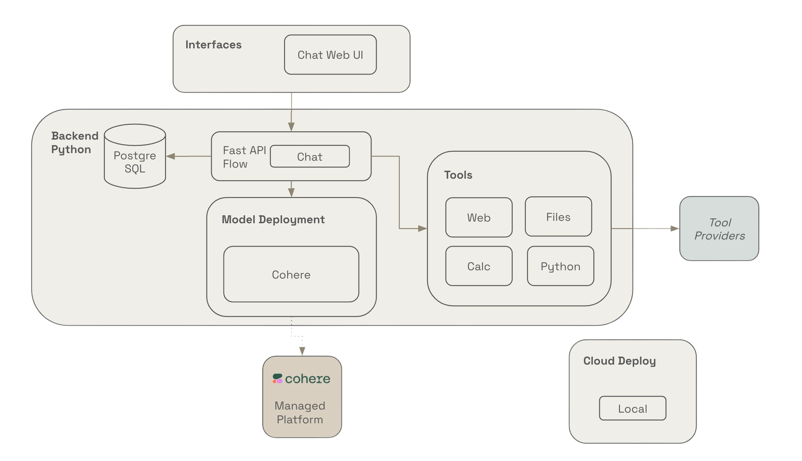
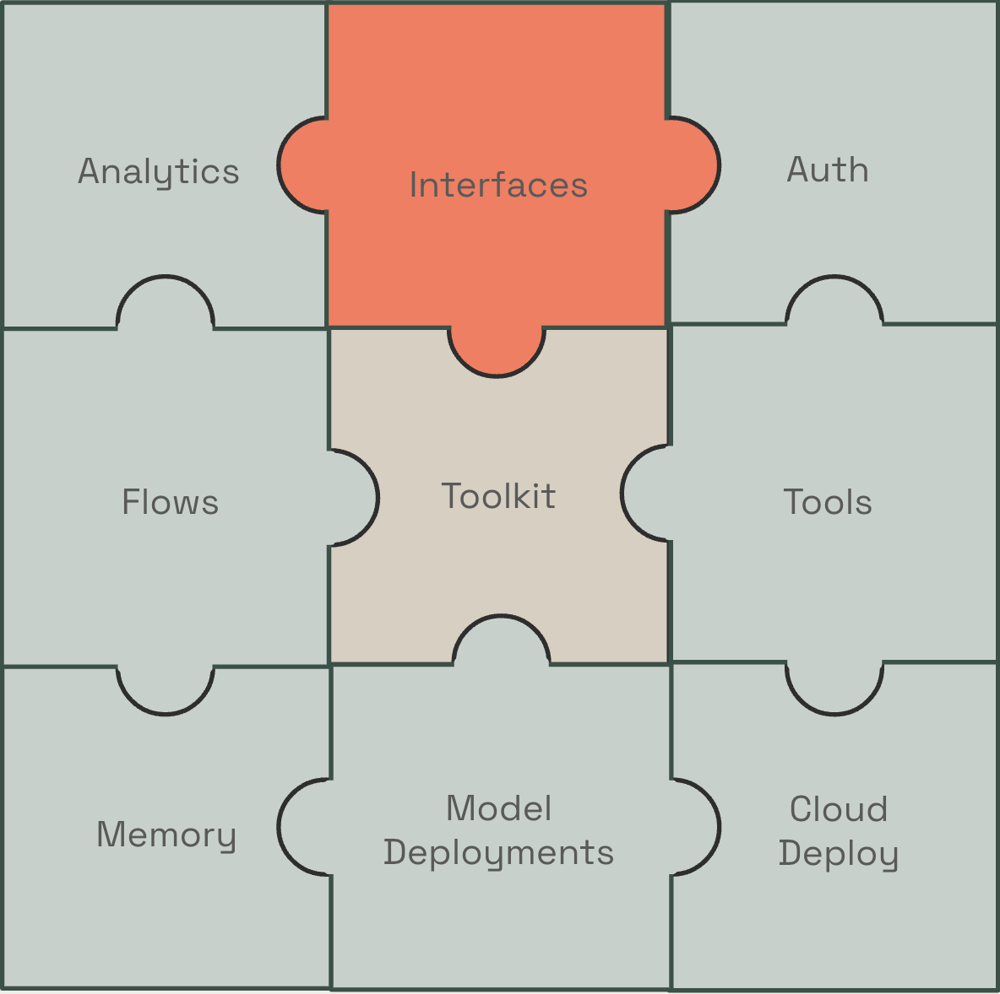
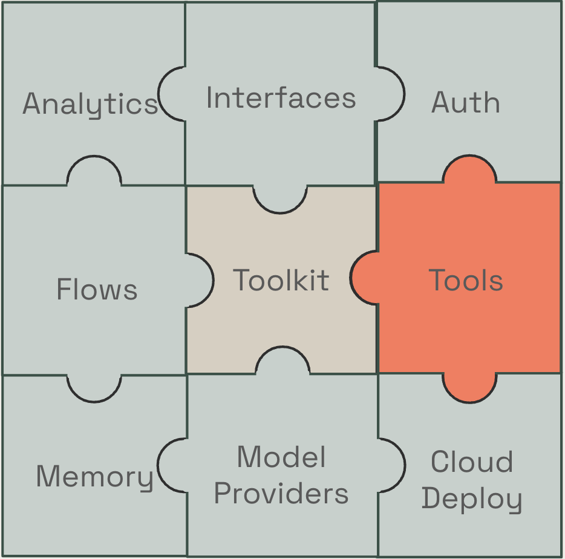
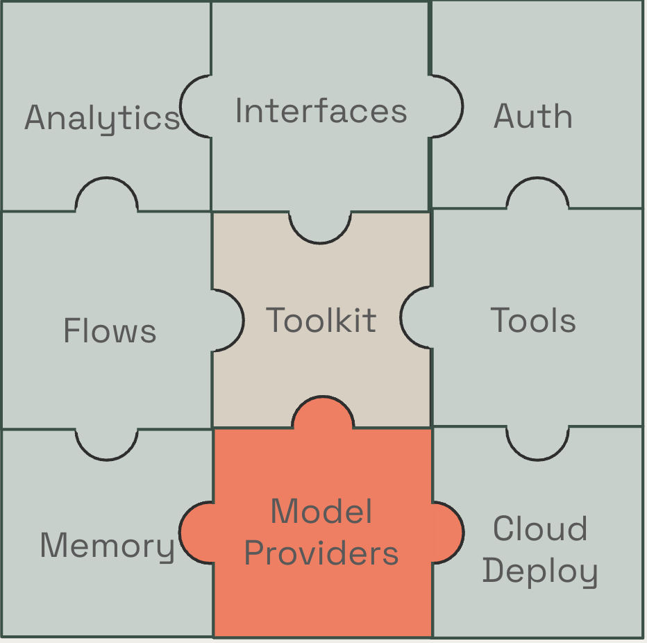
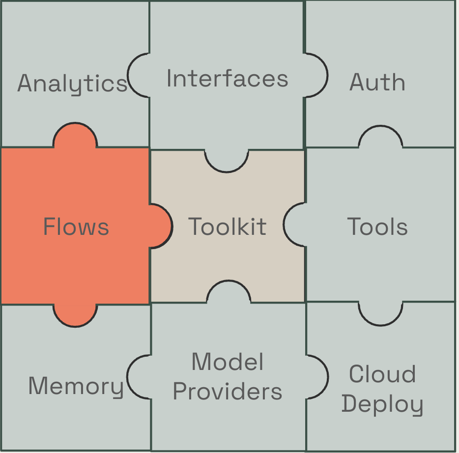
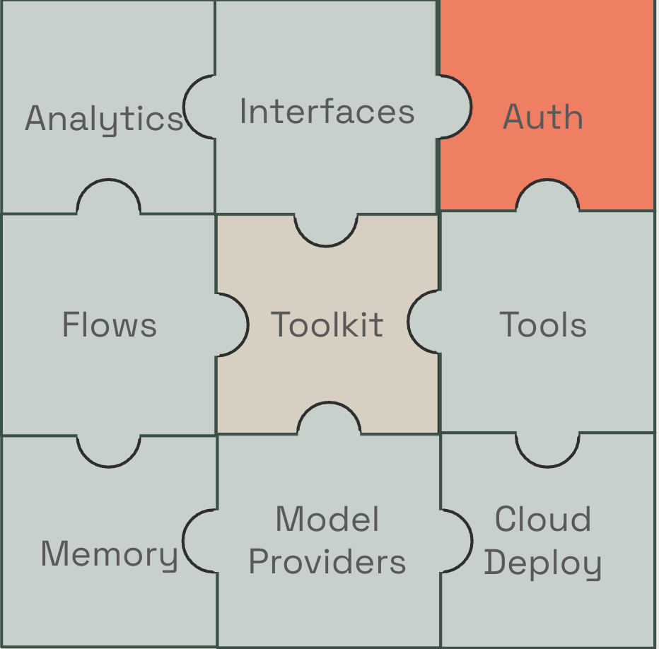
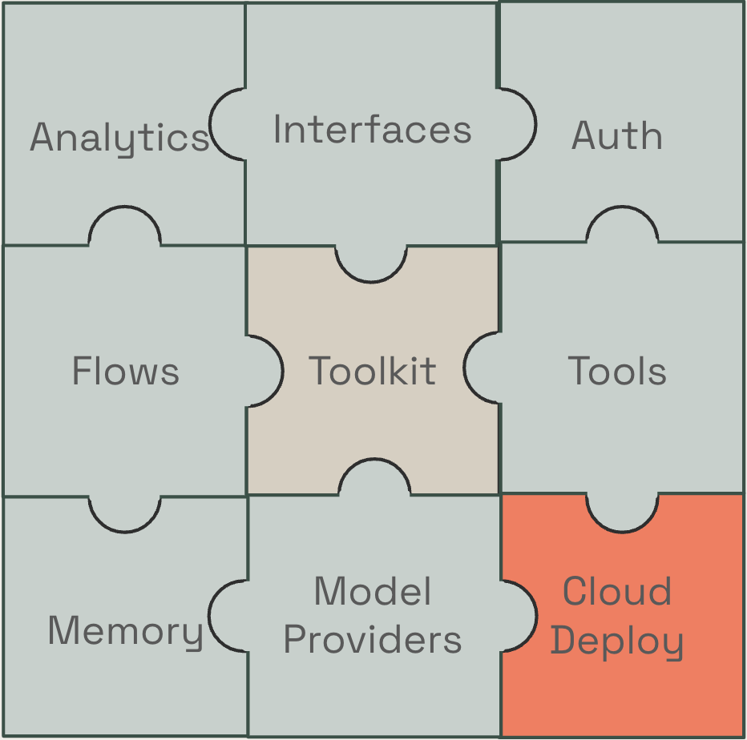
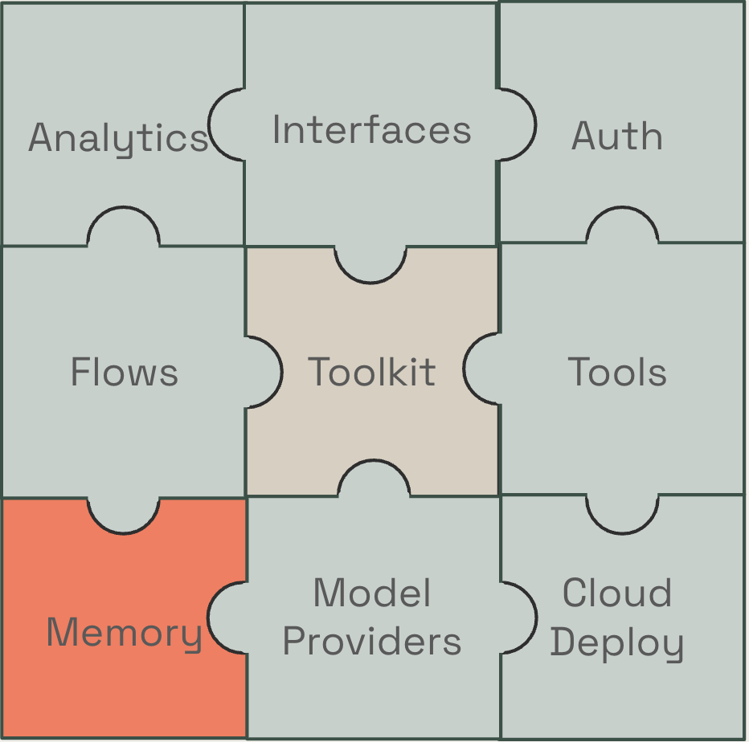
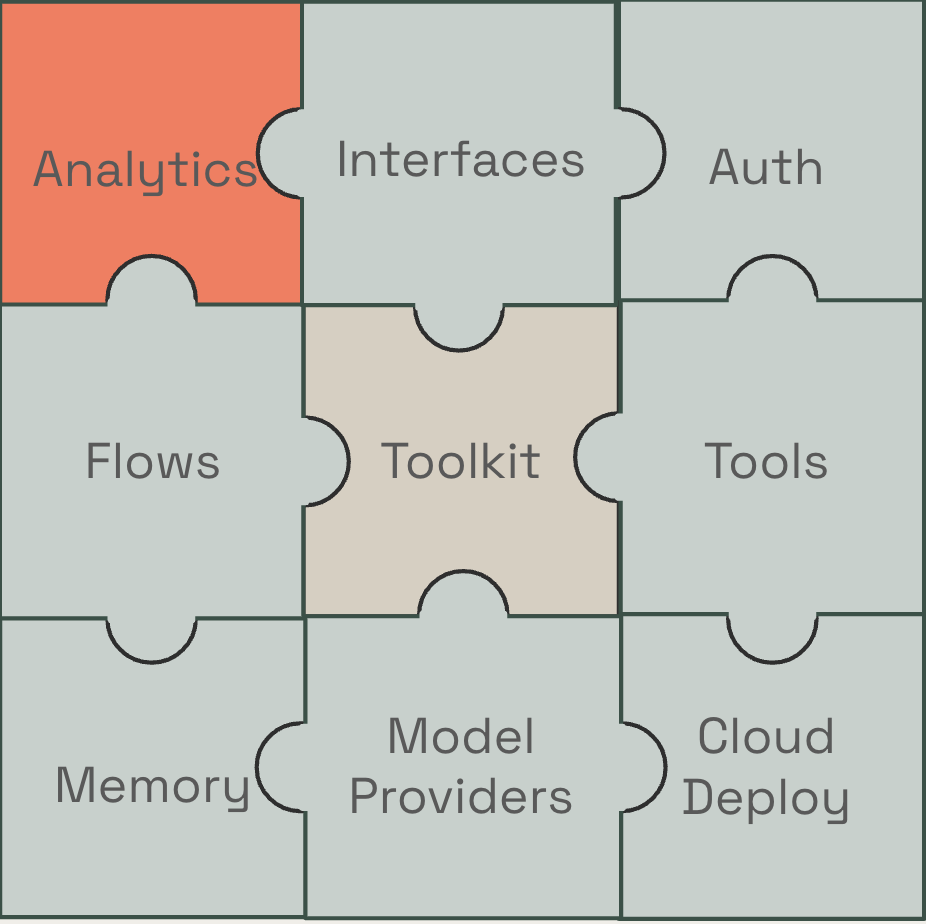

  
  <h1 align="center" >Toolkit Guide</h1>

Cohere Toolkit is a collection of plug-in pre-built components enabling customers to quickly build and deploy **production** level RAG applications. Principles of the toolkit is that it is:

- Quick and simple to set up a light weight version
- Quick and simple to configure for your needs
- Quick and simple to deploy for production usage
- Quick and simple to contribute through open source
- Quick and simple to set up on any cloud provider

<h2>Initial Set Up</h2>

When you first set up the toolkit by running one of the following commands:
- `docker run -e COHERE_API_KEY='>>YOUR_API_KEY<<' -p 8000:8000 -p 4000:4000 ghcr.io/cohere-ai/cohere-toolkit:latest` 
- Or cloning:
  - `git clone https://github.com/cohere-ai/cohere-toolkit.git`
  - `cd cohere-toolkit`
  - `make first-run`

The default configuration of the toolkit is: 

On top of this the toolkit offers many configurable components  

Below we will go through each of these components including the prebuilt options and how to plug in your own. 

  
  <h1 align="center" >Interfaces</h1>

Interfaces are applications on top of the backend API this could be anything from a website, workflows, a bot etc. 

Pre-built interfaces which your can customize to your needs include:
- Chat UI (Coral)

- SlackBot

To add your own: 

- You can add your own interface at `src/interfaces/{custom_frontend}`, which calls into the backend API at env variable NEXT_PUBLIC_API_HOSTNAME. 
- You can test the API calls needed to the backend with the postman collection. 

  
  <h1 align="center" >Tools</h1>

Tools can be any function, data provider, connector, vector store, third-party app, LangChain tool/retriever, llamaIndex integration, OpenSearch integration of your choosing. 

Pre-built tools which your can customize to your needs include:
- Calculator
- Web Search
- Python Interpreter 
- Files

To add your own we have a [detailed guide here](../custom_tool_guides/tool_guide.md) and the main steps are:

- Add your tool file at `src/backend/tools/{custom_tool_name}` (for open source contributions add to the community folder)
- The tool needs to implement a `call` function
- Then add the config of the tool to `src/backend/config/tools.py`
- You can then view the tool in the chat UI or for customer interfaces add the tool to the API request to use it. 

Coming soon: Support for tools that require authentication. 

  
  <h1 align="center" >Model Providers</h1>

There is no required connection to cohere's platform. You can plug in any model provider to use Cohere's models including local models. A model provider is a service which allows you to make requests to Cohere's models. 

Pre-built model providers which your can customize to your needs include:
- Cohere Platform
- Azure 
- AWS (Bedrock and Sagemaker)
- Local Models (with raw prompting)
- Hugging Face

We have a [detailed guide for these model providers here](../command_model_providers.md).

To add your own:
- Add a file to `src/backend/model_deployments/{custom_provider}`
- Implement the `invoke` functions such as `invoke_chat_stream`
- Add your model config at `src/backend/config/deployments.py`

  
  <h1 align="center" >Flows</h1>

A "flow" is the main orchestration piece of the toolkit. We have a default chat flow at `src/backend/chat/custom/custom.py` which handles calling the tools and models. 

Additionally there is an experimental LangChain flow which uses raw prompting at `src/backend/chat/custom/langchain.py`.

You would add your own flow at `src/backend/chat/customer/{flow_name}` or customize the current ones if you wanted to experiment with a large new feature such as adding video or image elements. 

  
  <h1 align="center" >Authentication</h1>

Authentication is the piece that enables multiple user's to use your application. If you don't enable any authentication piece by default there is only one user. 

Pre-built authentication which your can customize to your needs include:
- Basic (password+username)
- Google OAuth  
- OIDC 

We have a [detailed guide for auth here](../auth_guide.md). Note authentication is currently under development. 

  
  <h1 align="center" >Cloud Deployment</h1>

Cloud Deployment's are options for you to deploy your application to a cloud. We have detailed instructions and one click deployment options for cloud providers. 

Pre-built cloud deployments which your can customize to your needs include:
- Google Cloud Provider (GCP)
- Azure 
- AWS
- K8s support

We have a [detailed guide for each cloud deployment here](../service_deployments.md). 

  
  <h1 align="center" >Memory (Storage)</h1>

The toolkit stores history of conversations to improve next turn generations. It stores these turns in a PostgreSQL database. It is possible to switch this out for a database that you prefer. There is also an option with no storage. 

  
  <h1 align="center" >Analytics</h1>

Currently in development. 
